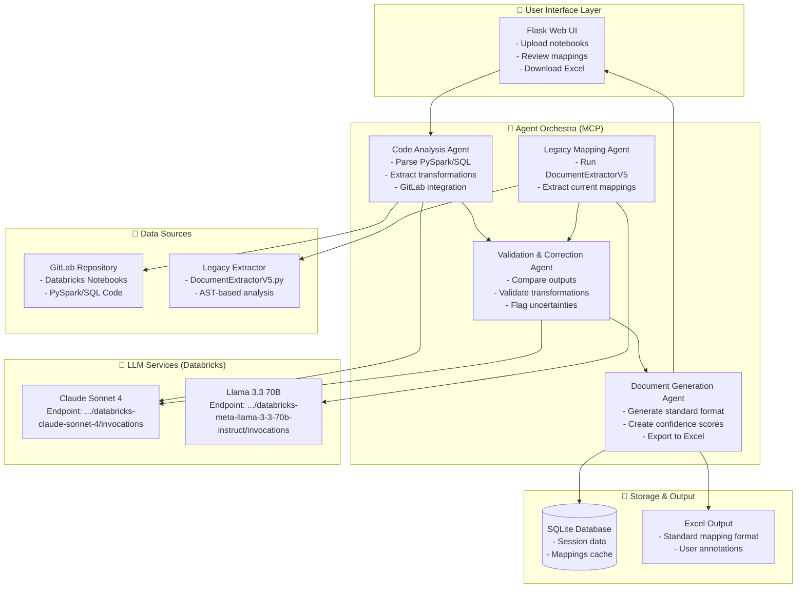

# Agentic Mapping Document Generator

## Overview

This project implements an AI-powered agentic system that automatically generates standard mapping documents from Databricks notebooks containing PySpark and SQL transformations. The system uses multiple AI agents orchestrated through the Model Context Protocol (MCP) to analyze code, extract transformations, validate results, and generate standardized documentation.

## Architecture

The system consists of four main AI agents:

1. **Code Analysis Agent** - Analyzes PySpark/SQL code from GitLab repositories
2. **Legacy Mapping Agent** - Runs the existing DocumentExtractorV5 for comparison
3. **Validation Agent** - Compares outputs and validates/corrects mappings using Claude LLM
4. **Document Generation Agent** - Generates final standardized mapping documents

### System Architecture Diagram



### Agent Workflow

The agents work in a coordinated workflow:
1. **Code Analysis Agent** fetches and analyzes the notebook using AST parsing and Claude LLM
2. **Legacy Mapping Agent** runs the existing DocumentExtractorV5 for comparison baseline
3. **Validation Agent** compares both outputs, resolves conflicts using Claude LLM intelligence
4. **Document Generation Agent** creates the final standardized mapping document with confidence scores

## Features

- **Multi-Agent Workflow**: Coordinated AI agents for comprehensive analysis
- **GitLab Integration**: Fetches notebooks directly from GitLab repositories
- **Dual LLM Support**: Uses both Claude Sonnet 4 and Llama 3.3 70B for accuracy
- **Interactive UI**: Flask-based web interface for review and editing
- **Confidence Scoring**: AI-generated confidence scores for each mapping
- **Review Flagging**: Automatically flags uncertain mappings for human review
- **Excel Export**: Export results to Excel format matching existing templates

## Installation

1. **Clone the repository**:
   ```bash
   git clone <repository-url>
   cd Databricks_App
   ```

2. **Install dependencies**:
   ```bash
   pip install -r requirements.txt
   ```

3. **Set up environment variables**:
   ```bash
   cp .env.example .env
   # Edit .env with your actual configuration
   ```

4. **Initialize the database**:
   ```bash
   python -c "from app import app; from models.database import db; app.app_context().push(); db.create_all()"
   ```

## Configuration

### Environment Variables

- `DATABRICKS_TOKEN`: Your Databricks API token for LLM access
- `CLAUDE_ENDPOINT`: Claude Sonnet 4 endpoint URL
- `LLAMA_ENDPOINT`: Llama 3.3 70B endpoint URL
- `DATABASE_URL`: Database connection string (default: SQLite)
- `SECRET_KEY`: Flask secret key for sessions

### GitLab Integration

For GitLab integration, you'll need:
- GitLab URL (e.g., `https://gitlab.example.com`)
- Project ID
- Access token with read permissions

## Usage

1. **Start the application**:
   ```bash
   python app.py
   ```

2. **Access the web interface**:
   Open `http://localhost:5000` in your browser

3. **Analyze a notebook**:
   - Enter the notebook path (e.g., `load_silver_provider.py`)
   - Optionally configure GitLab credentials
   - Click "Start Analysis"

4. **Review results**:
   - View generated mappings in the interface
   - Review flagged items requiring human validation
   - Edit mappings as needed
   - Export to Excel when ready

## API Endpoints

### Analysis
- `POST /api/analyze` - Start notebook analysis
- `GET /api/sessions/<id>/results` - Get analysis results
- `POST /api/sessions/<id>/update` - Update mapping results

### Export
- `GET /api/sessions/<id>/export` - Export to Excel format

### Health Check
- `GET /api/health` - System health status

## Output Format

The system generates mapping documents in the standard format:

| Source Table | Source Column | Transformation / Mapping Rules | Field | Array Field |
|--------------|---------------|--------------------------------|-------|-------------|
| provider_drname | nationalid | nationalid | service_provider_id | |
| provider_drname | dr_fname | dr_fname | name_first_name | |

## Technology Stack

- **Backend**: Flask, SQLAlchemy, AsyncIO
- **Frontend**: Vue.js, Axios
- **Database**: SQLite (configurable)
- **AI/LLM**: Databricks-hosted Claude & Llama models
- **Code Analysis**: Python AST, Regex patterns
- **Agent Framework**: Microsoft Agent Framework